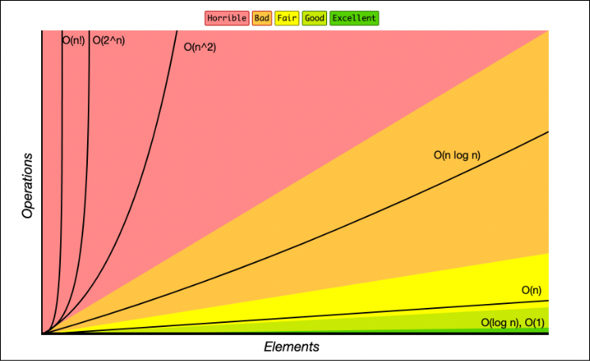

# Big O notation

La notación Big O es una técnica para analizar la complejidad espacial y temporal de un algoritmo.

Fue introducida por el matemático alemán Paul Bachmann en 1894 y popularizada por el matemático alemán Edmund Landau en a principios del siglo XX. Aunque originalmente se desarrolló para análisis matemático, su uso en informática se hizo común en la década de 1960 y 1970, especialmente con la obra de Donald Knuth, quien la utilizó para analizar la eficiencia de los algoritmos.

## ¿Para que sirve?

La notación Big O se utiliza para describir la eficiencia de un algoritmo en términos de tiempo y espacio. En términos generales, la notación Big O describe la relación entre el tamaño de la entrada y el tiempo que tarda un algoritmo en ejecutarse.

1. **Tiempo de Ejecución**: Cuánto tiempo toma un algoritmo para completar su tarea a medida que el tamaño de la entrada crece.
2. **Uso de espacio**: Cuánta memoria se necesita para ejecutar un algoritmo a medida que el tamaño de la entrada crece.

## ¿Cómo Funciona?

Big O notation proporciona una forma de describir el crecimiento de la complejidad de un algoritmo en función del tamaño de la entrada, denotado generalmente como \( n \). Las funcionas más comunes en Big O notation son:

1. **O(1)**: Tiempo constante. El tiempo de ejecución no cambia con el tamaño de la entrada.
2. **O(n)**: Tiempo lineal. El tiempo de ejecución crece linealmente con el tamaño de la entrada.
3. **O(log n)**: Tiempo logarítmico. El tiempo de ejecución crece logarítmicamente con el tamaño de la entrada.
4. **O(n log n )**: Tiempo log-lineal. El tiempo de ejecución crece en función del tamaño de entrada multiplicado por su logaritmo.
5. **O(n^2)**: Tiempo cuadrático. El tiempo de ejecución crece con el cuadrado del tamaño de la entrada.
6. **O(2^n)**: Tiempo exponencial. El tiempo de ejecución se duplica con cada incremento en el tamaño de la entrada.

## Ejemplos

1. **O(1)**: Acceder a un elemento en un array por índice.

```java
int getValue(int[] arr, int index) {
    return arr[index];
}
```

Acceder a un elemento en un array utilizando su índice es una operación que siempre toma el mismo tiempo, sin importar el tamaño del array. Los arrays están diseñados para permitir el acceso directo a cualquier posición en tiempo constante, ya que simplemente calculan la dirección de memoria del elemento deseado.

2. **O(n)**: Recorrer un array.

```java
void printAllElements(int[] arr) {
    for (int i = 0; i < arr.length; i++) {
        System.out.println(arr[i]);
    }
}
```

El tiempo de ejecución crece de manera proporcional al tamaño del array. Si el array tiene \( n \) elementos, el bucle se ejecutará \( n \) veces, y cada iteración realiza una operación constante (imprimir un elemento).

3. **O(log n)**: Búsqueda binaria en un array ordenado.

```java
int binarySearch(int[] arr, int target) {
    int left = 0;
    int right = arr.length - 1;
    while (left <= right) {
        int mid = left + (right - left) / 2;
        if (arr[mid] == target) {
            return mid;
        }
        if (arr[mid] < target) {
            left = mid + 1;
        } else {
            right = mid - 1;
        }
    }
    return -1;
}
```

La búsqueda binaria divide el espacio de búsqueda a la mitad en cada iteración del bucle `while`. Esto significa que con cada paso, la cantidad de elementos restantes para verificar se reduce en un factor de dos, es decir, a la mitad. Como resultado, el número de los pasos necesarios es logarítmico en relación con el tamaño del array (logaritmo en base 2 de \( n \)). Esta es una de las técnicas mas eficientes para buscar en arrays ordenados.

4. **O(n^2)**: Tiempo cuadrático. Búsqueda de duplicados en un array sin usar estructuras de datos adicionales.

```java
boolean hasDuplicates(int[] arr) {
    for (int i = 0; i < arr.length; i++) {
        for (int j = i + 1; j < arr.length; j++) {
            if (arr[i] == arr[j]) {
                return true;
            }
        }
    }
    return false;
}
```

El tiempo de ejecución crece con el cuadrado del tamaño del array. El bucle exterior se ejecuta n veces y, para cada iteración del bucle exterior, el bucle interior puede ejecutarse hasta n - 1 veces (en promedio, n/2). Esto resulta en un número total de comparaciones de aproximadamente n x n, lo cual es \( n^2 \).

#### Orden de complejidad de menor a mayor

1. **O(1)** - Constante
2. **O(log n)** - Logarítmico
3. **O(n)** - Lineal
4. **O(n log n)** - Log-lineal
5. **O(n^2)** - Cuadrático
6. **O(2^n)** - Exponencial

## Gráfica de Big O notation



## Análisis de tiempo

Para hacer un análisis de tiempo hay que medir el numero de operaciones que realiza el algoritmo.

- Acceso: `lista[i] matriz[i][j]`
- Aritmética: `+ - * /`
- Comparación: `== != < > <= >=`

Por ejemplo si queremos sumas 1 a cada elemento de una lista `[1, 2, 3, 4, 5]` para ello debemos recorrer la lista elemento por elemento y sumarle 1. Para esto debemos acceder al elemento, sumarle 1 y acceder nuevamente para modificar el valor, esto para cada uno de los elementos de la lista, serían 15 operaciones para esta lista. Para una lista de `n` elementos serían `3n` operaciones, como en Big O eliminamos las constantes, la complejidad de este algoritmo sería `O(n)`.

Otro ejemplo, donde tenemos dos listas del mismo tamaño `[1,2,3]` y `[2,3,4]` y queremos contar cuantas veces se repiten los números entre ellas, para ellos creamos un contador que se inicializa en 0 y recorremos ambas listas.

- Accedemos al primer elemento de la primera lista.
- Accedemos al primer elemento de la segunda lista.
- Comparamos si son iguales.
- Si no son iguales pasamos al siguiente elemento de la segunda lista.
- Si son iguales incrementamos el contador, osea accedemos al contador, le sumamos 1 y accedemos para guardar el nuevo valor.

Si no son iguales son 3 operaciones, pero si son iguales son 6, entonces serian entre 3 y 6 operaciones por cada par de elementos que comparamos, en un par de lista de 3 elementos, se recorren 3 elementos de la primera lista y por cada uno de estos 3 de la segunda `3 x 3 = 9` iteraciones, serian `27` operaciones si no son iguales y `54` si son iguales. En un par de listas de n elementos sería `n x n = n^2` iteraciones, osea `3n^2` o `6n^2` operaciones, la complejidad de este algoritmo sería `O(n^2)`, orden cuadrático.

En casos como este en donde buscamos en dos listas, se puede dar que el el orden varíe entre `O(1)` en el mejor caso y `0(n^2)` en el peor caso, Big O siempre toma el caso peor, es por eso que en estos tipos siempre seria ``O(n^2)``.